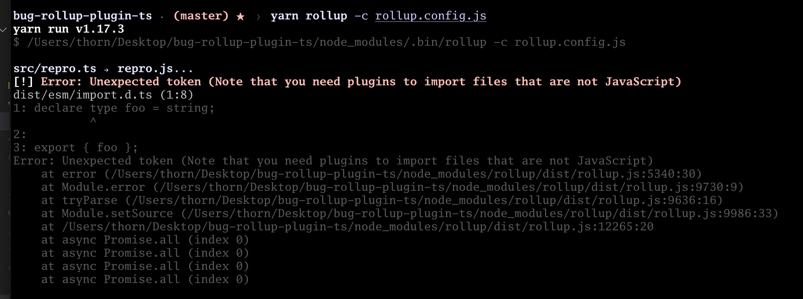

# 🐛--bug-repro-rollup-plugin-ts

Status: **[Reported](https://github.com/wessberg/rollup-plugin-ts/issues/71)**

Rollup is trying to load the [dist/esm/import.d.ts](dist/esm/import.d.ts) file and failing because it's not JavaScript.

The `dist` directory included in-repo is contrived for this minimal bug reproduction. I am running into this problem in real life because i am trying to import (for testing purposes) the dist of the current package. This began failing in https://github.com/wessberg/rollup-plugin-ts/releases/tag/v1.2.0, but works as I expect in earlier releases.

## license

See [LICENSE](LICENSE)
